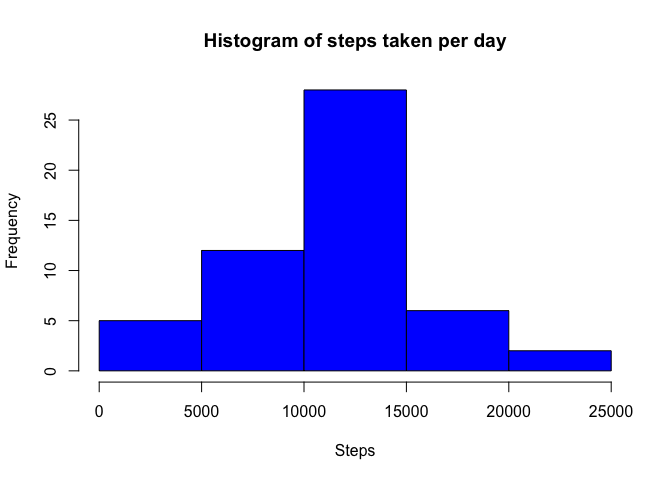
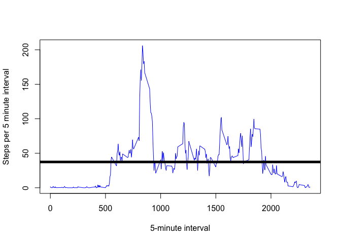
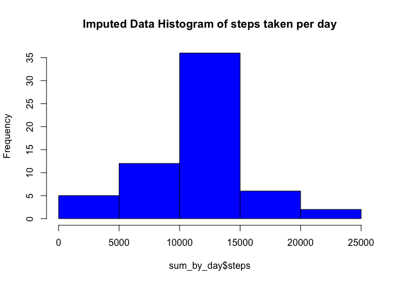
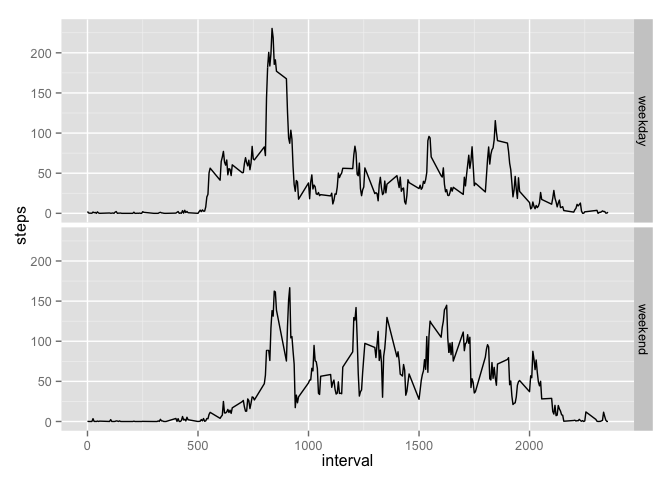

# Reproducible Research: Peer Assessment 1

Telvis Calhoun 12/2015

This assignment makes use of data from a personal activity monitoring device. This device collects data at 5 minute intervals through out the day. The data consists of two months of data from an anonymous individual collected during the months of October and November, 2012 and include the number of steps taken in 5 minute intervals each day.

## Loading and preprocessing the data

First, lets load libraries used in the analysis


```r
library(lubridate)
library(dplyr)
library(ggplot2)
```

Let's load the data

```r
df <- read.csv("activity.csv", na.strings = "NA", stringsAsFactors = FALSE)
```

Lets filter rows that have `NA` values for steps and convert date string to POSIXlt objects.

```r
df <- subset(df, !is.na(steps))
df <- transform(df, date=ymd(date))
```


## What is mean total number of steps taken per day?

Calculate the total number of steps taken per day.


```r
sum_by_day <- summarize(group_by(df, date), steps=sum(steps, na.rm=TRUE))
sum_by_day <- arrange(as.data.frame(sum_by_day), desc(steps))
head(sum_by_day)
```

```
##         date steps
## 1 2012-11-23 21194
## 2 2012-11-22 20427
## 3 2012-10-12 17382
## 4 2012-10-06 15420
## 5 2012-10-31 15414
## 6 2012-11-18 15110
```

Make a histogram of the total number of steps taken each day


```r
hist(sum_by_day$steps, col="blue", main="Histogram of steps taken per day", xlab = "Steps")
```

 

Calculate and report the mean and median of the total number of steps taken per day.


```r
mean(sum_by_day$steps)
```

```
## [1] 10766.19
```

```r
median(sum_by_day$steps)
```

```
## [1] 10765
```


## What is the average daily activity pattern?
Make a time series plot (i.e. type = "l") of the 5-minute interval (x-axis) and the average number of steps taken, averaged across all days (y-axis).  


```r
# combine the date and minutes to make a date/timestamp
steps_by_interval <- summarize(group_by(df, interval), steps=mean(steps, na.rm=TRUE))

# plot time-series over the five minute intervals
plot(steps_by_interval$interval, 
     steps_by_interval$steps, 
     type="l", col="blue", xlab="5-minute interval", ylab="Steps per 5 minute interval")

# plot a horizontal line of the mean() steps for a 5-minute interval over all the days
abline(h = mean(steps_by_interval$steps), lwd=5, lty=1)
```

 

Which 5-minute interval, on average across all the days in the dataset, contains the maximum number of steps?


```r
steps_by_interval[which.max(steps_by_interval$steps),"interval"]
```

```
## Source: local data frame [1 x 1]
## 
##   interval
##      (int)
## 1      835
```

## Imputing missing values

Calculate and report the total number of missing values in the dataset (i.e. the total number of rows with NAs)


```r
df <- read.csv("activity.csv", na.strings = "NA", stringsAsFactors = FALSE)
df <- transform(df, date=ymd(date))
num_na <- sum(is.na(df$steps))
print(sprintf("Number of na steps : %d", num_na))
```

```
## [1] "Number of na steps : 2304"
```
  
Let's replace all values with the mean per interval over all days. 

```r
mean_by_interval <- summarize(group_by(df, interval), steps=mean(steps, na.rm=TRUE))
```
  
update rows with NA for steps. use mean_by_interval for the 'interval'

```r
for (i in 1:nrow(df)){
  if (is.na(df[i,"steps"])){
    df[i,"steps"] <- mean_by_interval[which(mean_by_interval$interval==df[i,"interval"]), "steps"]
  }
}
```

Generate a new histogram, median and mean for the imputed data. Using this technique, the mean and median are nearly identical to the values with `NA` values removed. This makes sense since I inserted 2304 values that are equal the mean for each interval.


```r
sum_by_day <- summarize(group_by(df, date), steps=sum(steps, na.rm=TRUE))
sum_by_day <- arrange(as.data.frame(sum_by_day), desc(steps))

# histogram
hist(sum_by_day$steps, col="blue", main="Imputed Data Histogram of steps taken per day")
```

 

```r
# median and mean
mean(sum_by_day$steps)
```

```
## [1] 10766.19
```

```r
median(sum_by_day$steps)
```

```
## [1] 10766.19
```

## Are there differences in activity patterns between weekdays and weekends?

Create a new factor variable in the dataset with two levels – “weekday” and “weekend” indicating whether a given date is a weekday or weekend day.

```r
# boolean 'TRUE' is Sat or Sun. Else FALSE.
df <- transform(df,is_weekend=weekdays(df$date) %in% c("Saturday", "Sunday"))

# Create factor values based on TRUE/FALSE
df <- mutate(df, is_weekend=factor(df$is_weekend, levels=c(FALSE, TRUE), 
                                   labels=c("weekday", "weekend")))
```

Now let's calcuate the mean for over the 5-minute intervals for weekdays and weekends.  

```r
# calculate mean per interval for 'weekdays'
mean_by_interval_weekday <- summarize(group_by(subset(df, is_weekend=='weekday'), interval), 
                                      steps=mean(steps, na.rm=TRUE))
max_for_weekday <- max(mean_by_interval_weekday$steps)

# calculate mean per interval for 'weekends'
mean_by_interval_weekend <- summarize(group_by(subset(df, is_weekend=='weekend'), interval), 
                                      steps=mean(steps, na.rm=TRUE))
max_for_weekend <- max(mean_by_interval_weekend$steps)

# combine data.frames with means summmaries
mean_by_interval_weekday$is_weekend='weekday'
mean_by_interval_weekend$is_weekend='weekend'
mean_by_interval <- rbind(mean_by_interval_weekday, mean_by_interval_weekend)
```

Now let's plot the `weekday` vs. `weekend` data aggregated over all weekdays of weekends.


```r
  # panel plot with facet on 'is_weekend'
qplot(interval, steps, data=mean_by_interval, geom="line", facets = is_weekend ~.)
```

 

The plot shows the max values for `weekdays` is 230.3781971 steps and for `weekends` its 166.6391509. The user logs more steps on weekdays than on weekends.


```r
# Both the median and max for weekdays is greater than on weekends
summary(mean_by_interval_weekday$steps)
```

```
##    Min. 1st Qu.  Median    Mean 3rd Qu.    Max. 
##   0.000   2.247  25.800  35.610  50.850 230.400
```

```r
summary(mean_by_interval_weekend$steps)
```

```
##    Min. 1st Qu.  Median    Mean 3rd Qu.    Max. 
##   0.000   1.241  32.340  42.370  74.650 166.600
```
  
